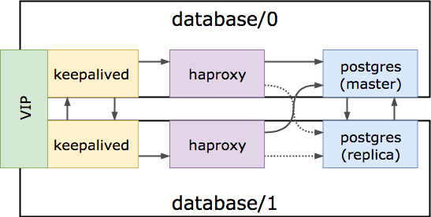

# PostgreSQL, BOSH-Style

This BOSH release packages up PostgreSQL so that you can deploy it
on BOSH.  It supports standalone, clustered, and HA
configurations.

# Supported Topologies

## Standalone Configuration

For a single, standalone PostgreSQL node, you only need the
`postgres` job:

```
instance_groups:
  - name: db
    jobs:
      - name:    postgres
        release: postgres
```

## Clustered Configuration

To enable replication, deploy multiple nodes and set the
`postgres.replication.enabled` property to "yes":

```
instance_groups:
  - name: db
    instances: 4
    jobs:
      - name:    postgres
        release: postgres
        properties:
          replication:
            enabled: true
```

In replicated mode, the bootstrap VM will assume the role of
master, and the remaining nodes will replicate from it, forming a
star topology.  No special query routing is done in this
configuration; applications that wish to make use of read replicas
must do so explicitly.

Promotion of a replica is left to the operator.

## HA Configuration

For a highly-available, single-IP pair of PostgreSQL nodes, the
`vip` job can be added.  Note that you *must* deploy exactly two
instances, or HA won't work.  Replication must also be enabled.

```
instance_groups:
  - name: db
    jobs:
      - name:    postgres
        release: postgres
        properties:
          replication:
            enabled: true   # don't forget this!

      - name:    vip
        release: postgres
        properties:
          vip: 10.3.4.5
```

HA is implemented with automatic failover, if you set
`postgres.replication.enabled` to true.

On bootstrap, if there is no data directory, the postgres job will
revert to a normal, index-based setup.  The first node will assume
the role of the master, and the second will become a replica.

Once the data directory has been populated, future restarts of the
postgres job will attempt to contact the other node to see if it
is a master.  If the other node responds, and reports itself as a
master, the local node will attempt a `pg_basebackup` from the
master and assume the role of a replica.

If the other node doesn't respond, or reports itself as a replica,
the local node will keep trying, for up to
`postgres.replication.grace` seconds, at which point it will
assume the mantle of leadership and become the master node,
using its current data directory as the canonical truth.

Each node then starts up a `monitor` process; this process is
responsible for ultimately promoting a local replica to be a
master, in the event that the real master goes offline.  It works
like this:

  1. Busy-loop (via 1-second sleeps) until the local postgres
     instance is available on its configured port.  This prevents
     monitor from trying to restart the postgres while it is
     running a replica `pg_basebackup`.

  2. Busy-loop (again via 1-second sleeps) for as long as the
     local postgres is a master.

  3. Busy-loop (again via 1-second sleeps), checking the master
     status of the other postgres node, until it detects that
     either the master node has gone away (via a connection
     timeout), or the master node has somehow become a replica.

  4. Promote the local postgres node to a master.

Intelligent routing can be done by colocating the `haproxy` and
`keepalived` jobs on the instance groups with `postgres`.  HAproxy
is configured with an external check that will only treat the
master postgres node as healthy.  This ensures that either load
balancer node will only ever route to the write master.

The `keepalived` node trades a VRRP VIP between the `haproxy`
instances.  This ensures that the cluster can be accessed over a
single, fixed IP address.  Each keepalived process watches its own
haproxy process; if it notices haproxy is down, it will terminate,
to allow the VIP to transgress to the other node, who is assumed
to be healthy.

It is possible to "instance-up" a single postgres node deploy to a
HA cluster by adding the `vip` job and changing postgres `instances`
to 2. More information about this can be found in `manifests/ha.yml`

For backup purposes, a route is exposed through haproxy which
routes directly to the read-only replica for backup jobs. By default
it is port `7432`, but is also configurable via `vip.readonly_port`

Here's a diagram:



The following parameters affect high availability:

  - `postgres.replication.enabled` - Enables replication, which is
    necessary for HA.  Defaults to `false`.

  - `postgres.replication.grace` - How many seconds to wait for
    the other node to report itself as a master, during boot.
    Defaults to `15`.

  - `postgres.replication.connect_timeout` - How many seconds to
    allow a `psql` health check to attempt to connect to the other
    node before considering it a failure.  The lower this value,
    the faster your cluster will failover, but the higher a risk
    of accidental failover and split-brain.  Defaults to `5`.

  - `vip.readonly_port` - Which port to access the read-only node
    of the cluster. Defaults to `7542`.

  - `vip.vip` - Which IP to use as a VIP that is traded between the
    two nodes.

### HA Failure Modes

Our HA solution is focused on preventing downtime in the face of
upgrades or other single-node failure. As such, we do not attempt to
solve scenarios where the two databases cannot communicate with one
another (e.g. network failure). In this case, it is possible that the
replica believes the master to be down, and will promote itself to be
master. The Postgres servers are then in a state of "split-brain" and
requests to the DB will be split between the two nodes.

To mitigate this, each node checks to see who is master. If both
nodes are master (split-brain), both immediately shut down to prevent
inconsistent data states. *This will result in downtime*. But we
downtime is preferable over inconsistent database states.

### Recovery From Failure Mode

After the proper database is chosen to be master, SSH into that node,
become root, and monit start `monitor`, `postgres`, and `haproxy`.

Then, SSH into the replica node, become root, and monit start
`monitor`, `postgres`, and `haproxy`.

The Postgres nodes will then run as normal.